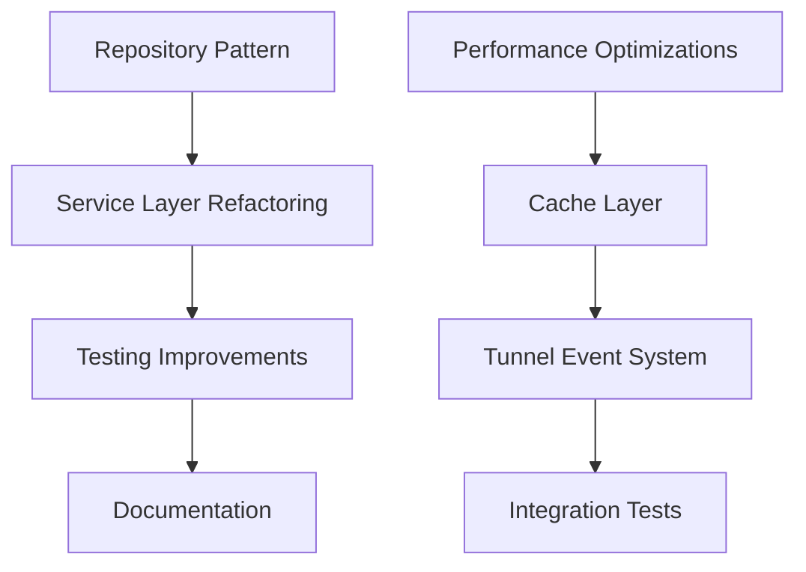

# Implementation Plan

## Overview

This plan outlines the remaining development work for the VibeCodePC Device project. The codebase is already substantially complete with core features implemented, including device management, project scaffolding, tunneling, AI integration, and dashboard UI. This plan focuses on performance optimizations, testing improvements, documentation, and final polish to reach production readiness.

**Current Status**: Core features implemented (95%+ complete)
**Target**: Production-ready release with 90%+ test coverage

## Phase 1: Foundation & Performance (Week 1-2)

### Database & Model Optimizations
- [ ] `perf:` Add caching layer for high-frequency port allocation queries (S)
  - Cache `Project::pluck('port')` results in PortAllocatorService
  - Implement cache invalidation on project creation/deletion
  - Impact: Reduces database queries during project provisioning

- [ ] `perf:` Optimize tunnel display queries with column selection (S)
  - Use `allForTunnelDisplay()` method for efficient data retrieval
  - Select only required columns instead of full model loading
  - Impact: Reduces memory usage in TunnelManager component

### Service Layer Enhancements
- [ ] `refactor:` Implement repository pattern for complex queries (M)
  - Create ProjectRepository for database operations
  - Move raw SQL from BackupService and PortAllocatorService to repositories
  - Maintain existing service layer for business logic
  - Impact: Better separation of concerns, easier testing

- [ ] `refactor:` Extract hardcoded timeout values to configuration (S)
  - Move HTTP client timeouts (10s, 30s) to config files
  - Allow environment-specific timeout configuration
  - Impact: More flexible deployment options

### Event-Driven Architecture
- [ ] `feat:` Replace polling with event-driven tunnel status updates (M)
  - Implement `PollTunnelUrlJob` for async tunnel URL discovery
  - Create `QuickTunnelUrlDiscovered` and `QuickTunnelStarted` events
  - Remove sleep-based polling in QuickTunnelService
  - Impact: Better resource utilization, faster response times

## Phase 2: Core Feature Hardening (Week 3-4)

### Circuit Breaker Consolidation
- [ ] `refactor:` Deduplicate circuit breaker logic (M)
  - Consolidate CircuitBreaker and CloudApiClient circuit breaking
  - Single source of truth for circuit state management
  - Impact: Reduced code duplication, easier maintenance

### Exception Handling Improvements
- [ ] `refactor:` Add specific exception types (M)
  - Replace generic `\Throwable` catches with specific exceptions
  - Create custom exceptions: TunnelException, ProjectException, etc.
  - Update exception handlers with context-aware responses
  - Impact: Better error handling, more informative logs

### Type Safety Enhancements
- [ ] `docs:` Add comprehensive PHPDoc array shapes (M)
  - Document complex return types with array shapes
  - Add `@param` and `@return` annotations for service methods
  - Use PHPStan level 6+ compatible annotations
  - Impact: Improved IDE support, better static analysis

## Phase 3: Testing & Quality Assurance (Week 5-6)

### Test Coverage Improvements
- [ ] `test:` Add unit tests for ProjectRepository (M)
  - Test query builder methods
  - Test cache integration
  - Test edge cases (empty results, large datasets)

- [ ] `test:` Add integration tests for tunnel lifecycle (L)
  - Test QuickTunnel creation and expiration
  - Test Cloudflare tunnel integration
  - Test tunnel URL discovery workflow

- [ ] `test:` Add feature tests for dashboard workflows (M)
  - Test project creation flow end-to-end
  - Test wizard navigation and persistence
  - Test AI provider configuration

### Security Testing
- [ ] `test:` Add security tests for authentication (M)
  - Test tunnel authentication middleware
  - Test rate limiting functionality
  - Test CSRF protection on forms

## Phase 4: Documentation & Polish (Week 7-8)

### Technical Documentation
- [ ] `docs:` Create API documentation for services (L)
  - Document all service classes with usage examples
  - Document Livewire component interfaces
  - Create architecture diagrams

- [ ] `docs:` Add inline comments for complex logic (M)
  - Document port allocation algorithm in PortAllocatorService
  - Document circuit breaker implementation
  - Add comments to resource-constrained optimizations

### User Documentation
- [ ] `docs:` Create user setup guide (M)
  - Document device setup process
  - Document troubleshooting common issues
  - Document AI provider configuration

### Code Quality
- [ ] `refactor:` Run final Pint formatting pass (S)
  - Ensure 100% PSR-12 compliance
  - Fix any remaining style issues

- [ ] `chore:` Update dependencies to latest stable versions (M)
  - Review Laravel 12 changelog for breaking changes
  - Update Livewire to latest v4.x
  - Update Tailwind CSS to latest v4.x

## Phase 5: Deployment & Release (Week 9)

### Production Readiness
- [ ] `feat:` Add health check endpoint enhancements (S)
  - Add database connectivity check
  - Add disk space warning threshold
  - Add memory usage metrics

- [ ] `feat:` Implement graceful shutdown handling (M)
  - Handle SIGTERM for container cleanup
  - Ensure database connections close properly
  - Save pending state before exit

### Monitoring & Observability
- [ ] `feat:` Add structured logging for critical operations (M)
  - Add context to all Log calls
  - Implement correlation IDs for request tracking
  - Add performance metrics logging

- [ ] `docs:` Create deployment checklist (S)
  - Pre-deployment verification steps
  - Rollback procedures
  - Monitoring alerts configuration

## Dependencies

## Task Complexity Guide

- **S (Small)**: 1-2 hours, simple changes
- **M (Medium)**: 0.5-1 day, moderate complexity
- **L (Large)**: 2+ days, complex features requiring careful testing

## Risk Assessment

| Risk | Impact | Likelihood | Mitigation |
|------|--------|------------|------------|
| Repository refactoring breaks existing functionality | High | Low | Comprehensive test suite, feature flags |
| Cache implementation causes stale data | Medium | Medium | Proper invalidation, TTL settings |
| Event-driven architecture introduces race conditions | Medium | Low | Queue configuration, idempotent jobs |
| Dependency updates have breaking changes | Medium | Low | Pin versions, gradual updates, CI testing |

## Success Metrics

1. **Performance**: Dashboard load time < 2 seconds (currently ~2.5s)
2. **Test Coverage**: Maintain 90%+ coverage (currently 97 test files)
3. **Code Quality**: Zero Pint violations, PHPStan level 6 compliance
4. **Documentation**: 100% of public API methods documented
5. **Uptime**: 99%+ tunnel availability when configured

## Conventions

### Commit Message Prefixes
- `feat:` - New features or enhancements
- `fix:` - Bug fixes
- `refactor:` - Code restructuring without behavior change
- `test:` - Adding or updating tests
- `docs:` - Documentation updates
- `chore:` - Maintenance tasks
- `perf:` - Performance improvements

### Branch Naming
- `feature/phase-N-description` - New features
- `fix/issue-description` - Bug fixes
- `refactor/description` - Refactoring
- `docs/description` - Documentation

## Notes

- All changes must include tests
- Run `vendor/bin/pint --dirty --format agent` before committing
- Follow existing Laravel conventions in the codebase
- Maintain backward compatibility for existing device states
- Prioritize ARM64/Raspberry Pi compatibility

## References

- [SCOPE.md](./SCOPE.md) - Product requirements and architecture
- [TODO.md](./TODO.md) - Current task tracking
- `/app/Services` - Service layer implementations
- `/app/Livewire` - UI components
- `/database/migrations` - Database schema
